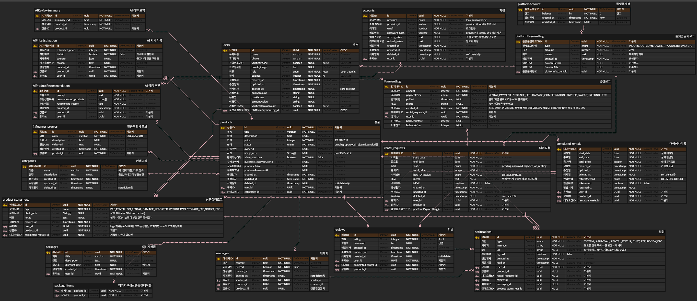

# FitPull Overflow (FOF)

## 프로젝트 소개

FitPull Overflow는 "자신에게 꼭 맞는 모든 것을 대여한다"는 컨셉의 대여 서비스 플랫폼입니다.  
물건, 장소, 사람, 재능까지 — 당신이 가진 어떤 것이든 필요한 누군가에게 빌려줄 수 있어요.

- `git pull`처럼 필요한 걸 당겨온다는 느낌 + 라임 맞추어서 `fit pull`
- `Stack Overflow`처럼 차고 넘치는 느낌을 주고 싶어서 `overflow`

---

### 기획 배경

이 프로젝트는 **바쁜 현대인 , 그 중 에서도 저와 같은 .. I성향 + 반복 작업을 최소화하고 싶은 사람들을** 위해 만들어졌어요.

- 직접 만나는 것은 수줍고 어려운데.. 방에 이제는 사용하지 않는 물건이 놀고있는건 불편하고...
- 수익은 내고 싶지만, 사진 찍기/배송/관리 같은 건 직접하려니 너무 귀찮고...
- 중고거래 특유의 애매한 톤앤매너도 어색하고... 새로운 사람 만나기는 너무 무섭고 피곤하고 ...
- 구매하고픈 상품이 있는데 막상 한번쯤은 사용해보고 구매를 결정하고 싶고 ...

그래서 **유저는 상품만 보내면**, 그 이후의 모든 과정은 어드민/운영진이 처리합니다.

- 상품 검수/촬영
- 보관 및 상태 기록
- 대여/반납 처리
- 문의 대응까지

**"No 직거래, No 피곤함"**

## FOF입니다.

## ERD


[ERD 원본 보기 (ERDCloud)](https://www.erdcloud.com/d/waj7NZ2NAPBamqBPM)

## 파일구조

```
📦 FitPull-BE
 ┣ 📂docs
 ┣ 📂prisma
 ┣ 📂scripts
 ┣ 📂tasks
📦src
 ┣ 📂configs
 ┃ ┗ 📜passport.js
 ┣ 📂constants
 ┃ ┣ 📜category.js
 ┃ ┣ 📜discount.js
 ┃ ┣ 📜commission.js
 ┃ ┣ 📜limits.js
 ┃ ┣ 📜messages.js
 ┃ ┣ 📜policy.js
 ┃ ┣ 📜s3.js
 ┃ ┗ 📜status.js
 ┣ 📂controllers
 ┃ ┣ 📜ai.controller.js
 ┃ ┣ 📜auth.controller.js
 ┃ ┣ 📜category.controller.js
 ┃ ┣ 📜completedRental.controller.js
 ┃ ┣ 📜influencerPromo.controller.js
 ┃ ┣ 📜message.controller.js
 ┃ ┣ 📜notification.controller.js
 ┃ ┣ 📜payment.controller.js
 ┃ ┣ 📜platform.controller.js
 ┃ ┣ 📜product.controller.js
 ┃ ┣ 📜productStatusLog.controller.js
 ┃ ┣ 📜purchase.controller.js
 ┃ ┣ 📜rentalRequest.controller.js
 ┃ ┣ 📜reviewController.js
 ┃ ┗ 📜user.controller.js
 ┣ 📂docs
 ┃ ┗ 📜swagger.js
 ┣ 📂middlewares
 ┃ ┣ 📜adminOnly.js
 ┃ ┣ 📜auth.js
 ┃ ┣ 📜errorHandler.js
 ┃ ┣ 📜influencerOnly.js
 ┃ ┣ 📜requireVerifiedPhone.js
 ┃ ┣ 📜s3ImageUpload.js
 ┃ ┗ 📜upload.js
 ┣ 📂repositories
 ┃ ┣ 📜ai.repository.js
 ┃ ┣ 📜auth.repository.js
 ┃ ┣ 📜category.repository.js
 ┃ ┣ 📜completedRental.repository.js
 ┃ ┣ 📜influencerPromo.repository.js
 ┃ ┣ 📜message.repository.js
 ┃ ┣ 📜notification.repository.js
 ┃ ┣ 📜payment.repository.js
 ┃ ┣ 📜platform.repository.js
 ┃ ┣ 📜product.repository.js
 ┃ ┣ 📜productStatusLog.repository.js
 ┃ ┣ 📜purchase.repository.js
 ┃ ┣ 📜rentalRequest.repository.js
 ┃ ┣ 📜review.repository.js
 ┃ ┗ 📜user.repository.js
 ┣ 📂routes
 ┃ ┣ 📜ai.routes.js
 ┃ ┣ 📜auth.routes.js
 ┃ ┣ 📜category.routes.js
 ┃ ┣ 📜completedRental.routes.js
 ┃ ┣ 📜influencerPromo.routes.js
 ┃ ┣ 📜message.routes.js
 ┃ ┣ 📜notification.routes.js
 ┃ ┣ 📜payment.routes.js
 ┃ ┣ 📜platform.routes.js
 ┃ ┣ 📜product.routes.js
 ┃ ┣ 📜productStatusLog.routes.js
 ┃ ┣ 📜purchase.routes.js
 ┃ ┣ 📜rentalRequest.routes.js
 ┃ ┣ 📜review.routes.js
 ┃ ┗ 📜user.routes.js
 ┣ 📂services
 ┃ ┣ 📜ai.service.js
 ┃ ┣ 📜auth.service.js
 ┃ ┣ 📜category.service.js
 ┃ ┣ 📜completedRental.service.js
 ┃ ┣ 📜influencerPromo.service.js
 ┃ ┣ 📜message.service.js
 ┃ ┣ 📜notification.service.js
 ┃ ┣ 📜payment.service.js
 ┃ ┣ 📜platform.service.js
 ┃ ┣ 📜product.service.js
 ┃ ┣ 📜productStatusLog.service.
 ┃ ┣ 📜purchase.service.js
 ┃ ┣ 📜rentalRequest.service.js
 ┃ ┣ 📜review.service.js
 ┃ ┗ 📜user.service.js
 ┣ 📂sockets
 ┃ ┗ 📜socket.js
 ┣ 📂utils
 ┃ ┣ 📜customError.js
 ┃ ┣ 📜jwt.js
 ┃ ┣ 📜nodemailer.js
 ┃ ┣ 📜notificationCleaner.js
 ┃ ┣ 📜notify.js
 ┃ ┣ 📜phoneVerification.js
 ┃ ┣ 📜redis.js
 ┃ ┣ 📜responseHandler.js
 ┃ ┣ 📜s3.js
 ┃ ┣ 📜sms.js  
 ┃ ┗ 📜storageFeeScheduler.js
 ┣ 📜app.js
 ┗ 📜data-source.js
 ┣ 📜.biome.json
 ┣ 📜.dockerignore
 ┣ 📜.env.example
 ┣ 📜.env.docker
 ┃ 📜.prettierrc
 ┃ 📜.eslint.config.js
 ┣ 📜.gitignore
 ┣ 📜docker-compose.yml
 ┣ 📜Dockerfile
 ┣ 📜package.json
 ┣ 📜README.md
 ┣ 📜socketClient.js
 ┣ 📜socketTest.html
 ┣ 📜todo.md
 ┣ 📜yarn.lock
```

## 기술 스택

<h3>Programming Languages & Frameworks</h3>
<div style="display: flex; flex-wrap: wrap; gap: 8px; align-items: center;">
  
  
  
  
  
</div>

<h3>Infrastructure / Database / AI</h3>  
<div style="display: flex; flex-wrap: wrap; gap: 8px; align-items: center;">


</div>

<h3>인증 / 문서화</h3>  
<div style="display: flex; flex-wrap: wrap; gap: 8px; align-items: center;">


</div>

<h3>Dev Tools</h3>  
<div style="display: flex; flex-wrap: wrap; gap: 8px; align-items: center;">


</div>

## 핵심 기능

### 1. 상품 등록 및 상태 관리

- **사용자 상품 등록**  
  사진 및 소개글을 포함한 상품 등록 기능 제공. 간단한 입력으로 누구나 쉽게 상품을 등록할 수 있습니다.

- **관리자 검수 시스템**  
  운영자 승인 후에만 상품이 공개되어, 품질 및 신뢰도를 확보합니다.

- **상품 상태 인증 시스템**  
  상품 대여 전후 상태를 로그로 남기고, S3에 이미지 업로드하여 분쟁 예방에 활용됩니다.

---

### 2. AI 기반 기능

- **상품 가격 분석**  
  상품명/이미지를 바탕으로 시장 가격 정보를 수집하고, 그에 따른 적정 가격을 제안하여 운영진의 업무를 도와줍니다. 

- **상황별 맞춤 상품 추천**  
  키워드를 기반으로 상황에 맞는 유사한 대여 상품을 추천합니다.

- **상품평 요약 기능**  
  장문/다수의 리뷰를 AI가 핵심만 추려 제공하여, 사용자 의사결정을 도와줍니다.

---

### 3. 대여 및 구매 시스템

- **예약 시스템**  
  사용자는 원하는 날짜(1달)을 지정해 상품을 예약할 수 있고, 중복 방지를 위해 관리됩니다. 

- **기간별 할인 적용**  
  대여 기간이 길수록 자동으로 할인율이 적용되어 경제적 선택을 유도합니다.

- **패키지 대여 기능**  
  연관된 여러 상품을 하나의 패키지로 묶어 대여할 수 있습니다.

- **상품대여 → 구매 할인**  
  상품을 대여하면 해당 상품 구매시 할인되어, 구매 전 체험 서비스로도 활용됩니다.

- **인플루언서 홍보관**  
  인플루언서가 홍보하는 상품을 대여/구매할시 할인되어 서비스 이용을 촉진합니다. 

---

### 4. 보안 및 인증

- **전화번호 인증**  
  회원가입 후 모든 서비스 이용을 위해선 전화번호 인증을 해야합니다. 이를 통해 사용자 실명성 및 신뢰도를 강화합니다.

- **탈퇴회원 이메일 인증**  
  회원탈퇴 시 이메일 인증을 통해 재가입이 가능합니다. 

- **상품 상태 로그 관리**  
  대여 전후 상품 상태를 시각적으로 기록해, 분쟁/책임 소재를 명확히 구분할 수 있도록 합니다.

- **모든 결제 로그 관리**  
  paymentLog , platformPaymentLog를 대여요청시, 대여완료시, 상품구매시, 유저취소, admin거절시 저장하고 관리하여 결제정보의 투명성을 보장합니다. 

---

### 📚 주요 카테고리

- 전자제품 / 의류 / 장소
- 시계 / 가방 / 책
- 사람 (재능 대여 포함)
- etc

## 비즈니스 모델

- 대여 수수료: 대여가격의 10 % 
- 판매 수수료: 판매가격의 5 %  
- 보관료: 장기 미대여(60일) 상품 보관료 징수 (1일 대여가격)  

## 향후 계획
- 패키지 상품 대여/구매 도입
- 대용량 처리 테스트
- 프론트엔드
- express/prisma -> nestJS/typeORM 마이그레이션

## 필수 조건

- Node.js
- Docker
- PostgreSQL (AWS RDS)

## 시작 하기

- 프로젝트 클론
- git clone https://github.com/P-FitPull/FitPull-BE.git
- docker 컨테이너 빌드 및 실행
- docker-compose up --build
